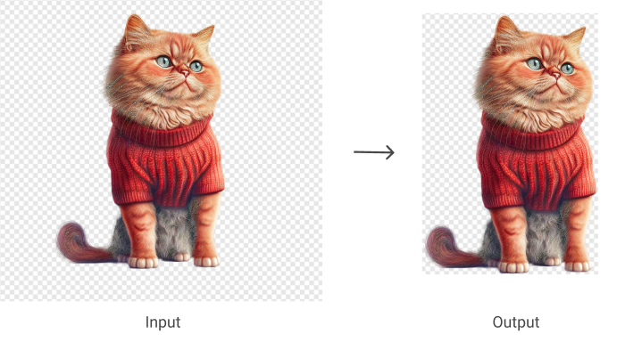

# autocrop-js



Node.js utility that crops the background of an image.

## Installation

```bash
npm install autocrop-js
```

## Usage

```js
import autocrop from 'autocrop-js'

const dataURL = 'data:image/png;base64,...'

autocrop(dataURL, {
  alphaThreshold: 10 // the lines and columns will be removed if the alpha channel is below the specified value (0-255). Default: 0
}).then(result => {
  console.log(result)
})
```

Output:

```js
{
  bgColor: '#ffffff', // background color of the image
  bbox: { // bounding box of the cut image fragment
    height: 188,
    width: 232,
    x: 26,
    y: 0
  },
  dataURL: 'data:image/png;base64,iVB...' // Data URL of the cut image fragment
}
```

## Testing

```bash
npm test
```

## Linting

```bash
npm run lint
```

## Contribution

If you find a bug or want to contribute to the code or documentation, you can help by submitting an [issue](https://github.com/freearhey/autocrop-js/issues) or a [pull request](https://github.com/freearhey/autocrop-js/pulls).

## License

[MIT](http://opensource.org/licenses/MIT)
